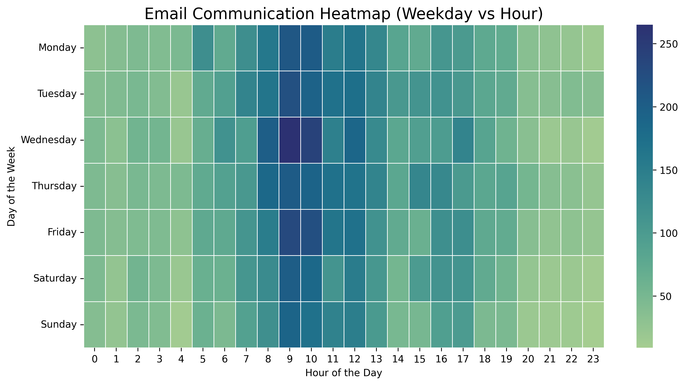
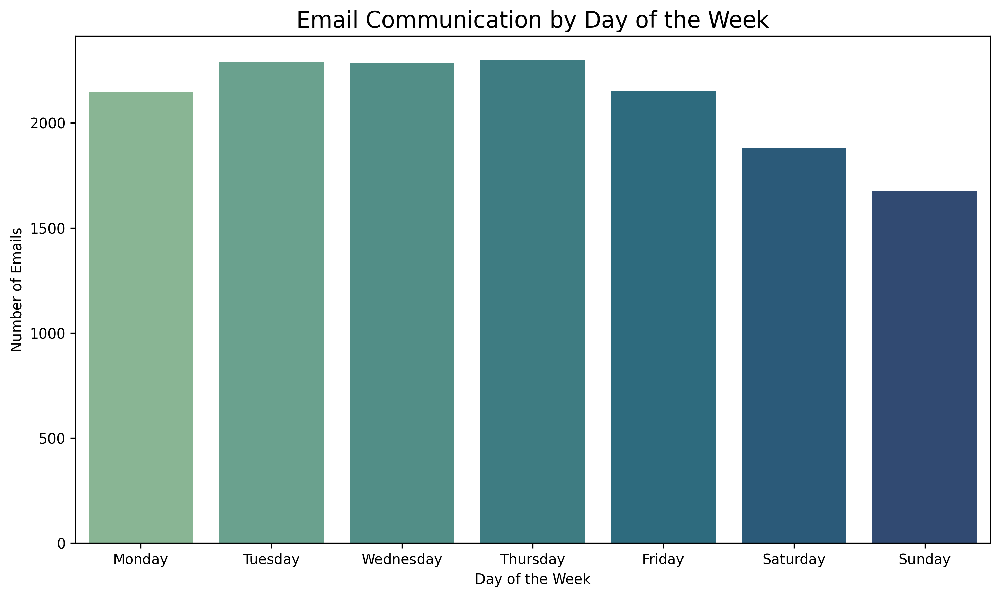
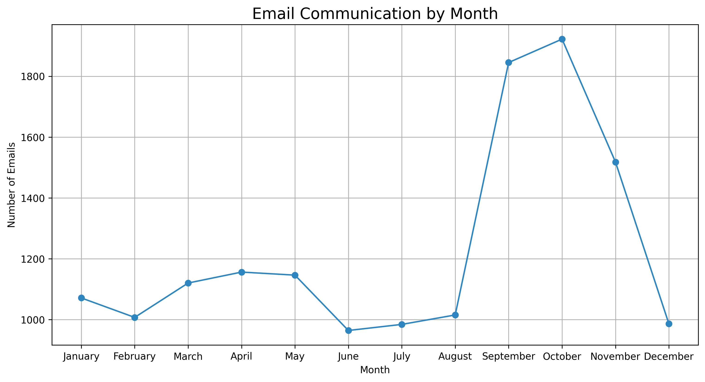
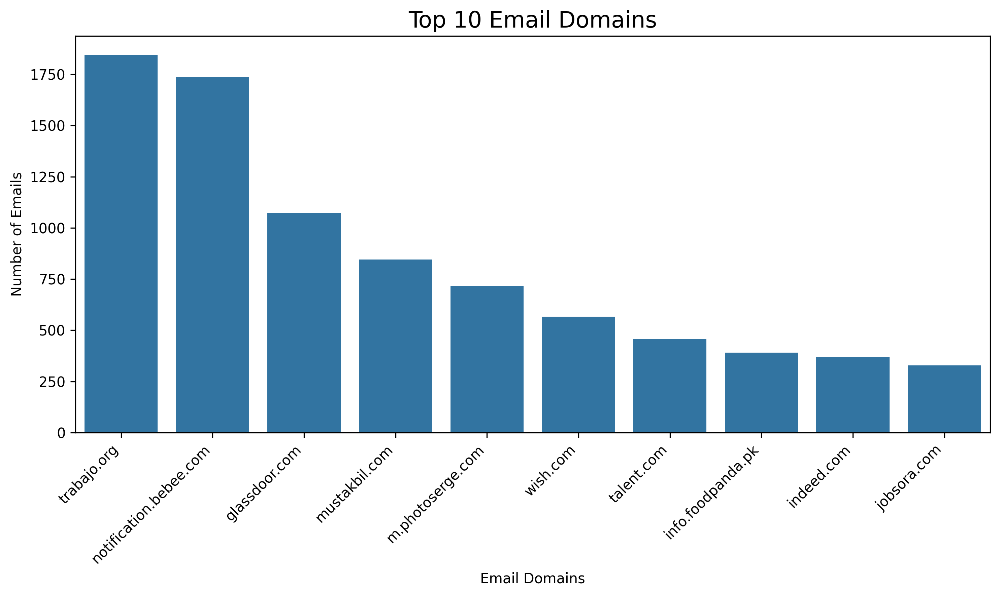

# 📧 Email-Based Job Market Analysis using NLP

## 📌 Overview

This project analyzes real-world email communication data to uncover patterns in communication behavior and extract insights related to job opportunities and recruitment trends.

By transforming raw and unstructured email data into a structured format, the analysis reveals temporal trends, dominant communication sources, and job market signals embedded within email subjects.

---

## 🎯 Problem Statement

Email data contains valuable but unstructured information that is difficult to interpret in its raw form.

The objective of this project is to:

- Identify communication patterns over time
- Extract meaningful insights from email subject lines
- Detect job-related trends and recruitment activity
- Understand how email behavior reflects real-world workflows

---

## 🚀 Approach

The project follows a structured data analysis pipeline:

- Extracted email data from `.mbox` files
- Converted raw data into a structured CSV format
- Performed data cleaning and preprocessing
- Engineered features such as:
  - Hourly, daily, and monthly activity
  - Sender domains and frequency
- Conducted Exploratory Data Analysis (EDA)
- Applied text analysis techniques (WordCloud, NLP)
- Visualized patterns and trends

---

## 🧹 Data Cleaning

- Removed missing and duplicate records
- Cleaned subject text by removing special characters, numbers, and noise
- Applied stopword removal (including custom stopwords)
- Standardized data formats for consistency

---

## ⚙️ Feature Engineering

- Extracted time-based features (hour, day, month)
- Processed subject text for keyword extraction
- Prepared structured data for analysis and visualization

---

## 📊 Exploratory Data Analysis

### ⏰ Email Activity by Hour



- Peak activity between **9 AM – 11 AM**
- Indicates alignment with standard business communication hours

---

### 📅 Email Activity by Day



- Highest activity from **Tuesday to Thursday**
- Significant decline during weekends

---

### 📆 Monthly Trends



- Stable activity in early months
- Noticeable increase in **September–October**, suggesting potential hiring cycles

---

### ☁️ Word Cloud


- Frequent terms: _developer, frontend, java, junior_
- Indicates strong demand for **software development roles**

---

## 📧 Email Domain Analysis



- A small number of domains account for the majority of email traffic
- Job platforms contribute a significant volume of emails
- Indicates centralized communication from automated systems

---

## 💼 Business Insights

- Email data can be leveraged to identify **job market trends and hiring demand**
- Communication patterns align with **standard business hours**
- Recruitment-related emails dominate inbox activity
- Useful for:
  - Email prioritization systems
  - Job opportunity tracking
  - Market trend analysis

---

## 🛠️ Tech Stack

- Python
- Pandas
- NumPy
- Matplotlib
- Seaborn
- WordCloud
- Regular Expressions (re)

---

## 📂 Project Structure

```
email-communication-analysis/
│
├── notebooks/
│   └── email_analysis.ipynb
├── images/
│   ├── email_activity_hour.png
│   ├── email_activity_day.png
│   ├── email_activity_month.png
│   ├── email_subject_wordcloud.png
│   └── email_domain.png
├── README.md
├── requirements.txt
└── .gitignore
```

---

## ▶️ How to Run

To run this project locally, follow these steps:

1. Clone the repository

```bash
git clone https://github.com/ozairshafique/email-communication-analysis.git
cd email-communication-analysis
```

2. Create a virtual environment (optional)

```bash
python -m venv venv
source venv/bin/activate   # Windows: venv\Scripts\activate
```

3. Install dependencies

```bash
pip install -r requirements.txt
```

4. Run Jupyter Notebook

```bash
jupyter notebook
```

5. Open:

```
notebooks/email_analysis.ipynb
```

---

## 📌 Requirements

- Python 3.x
- Jupyter Notebook

---

## ⚠️ Note on Data

The dataset used in this project is based on personal email data and is not included in this repository due to privacy and confidentiality reasons.

---

## 🔮 Future Improvements

- Apply machine learning for email classification (e.g., job vs spam)
- Implement TF-IDF and clustering for topic modeling
- Build an interactive dashboard using Streamlit
- Automate the end-to-end analysis pipeline

---

## 🏁 Conclusion

This project demonstrates how unstructured email data can be transformed into meaningful and actionable insights using data analysis and NLP techniques. It highlights communication patterns and provides valuable insights into job market dynamics.

---

## 👤 Author

Uzair Shaifque
GitHub: https://github.com/ozairshafique

---

## 📬 Contact

Feel free to connect for collaboration or opportunities:

- Email: uzair_11@hotmail.com
